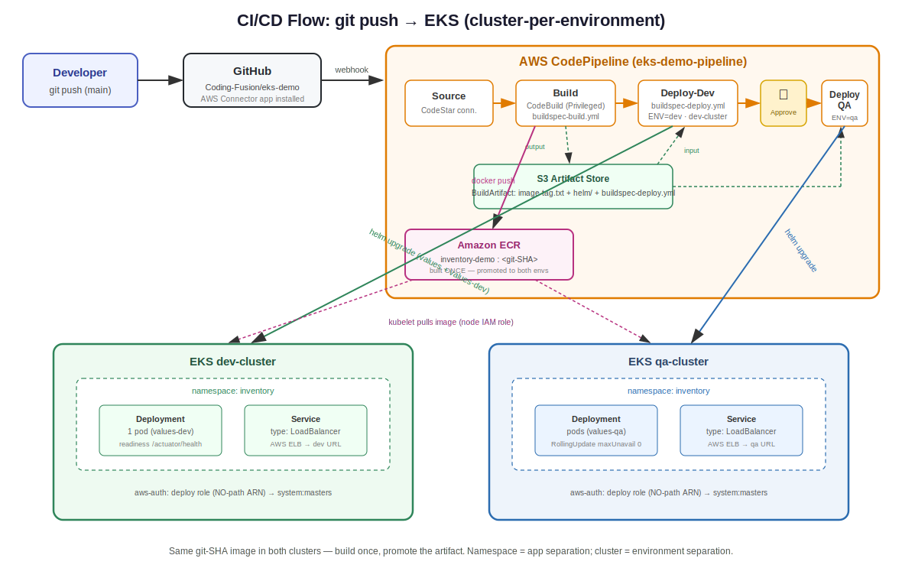
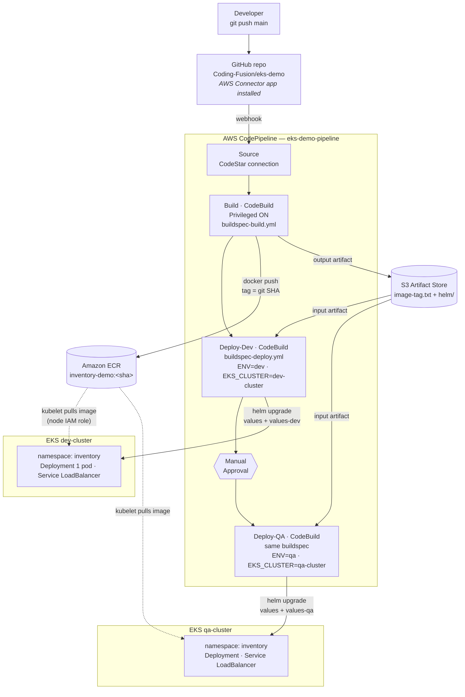

# AWS EKS CI/CD Pipeline Project — Complete Documentation

**Project:** End-to-end deployment pipeline for a Spring Boot microservice on AWS EKS,
replicating the Walmart KITT flow (git push → build → registry → Helm → Kubernetes)
using AWS-native services with a cluster-per-environment model.

**Author:** Debrath Banerjee
**Date:** July 2026
**Final architecture:**

```
git push → GitHub webhook → CodePipeline
    → Build (CodeBuild, buildspec-build.yml): Maven build inside multi-stage Docker → push to ECR (git-SHA tag)
    → Deploy-Dev (CodeBuild, buildspec-deploy.yml, ENV=dev, EKS_CLUSTER=dev-cluster): Helm → dev-cluster
    → Manual Approval gate
    → Deploy-QA (same buildspec, ENV=qa, EKS_CLUSTER=qa-cluster): Helm → qa-cluster
```

## Flow Diagram



*(Keep `eks-cicd-architecture.svg` in the same folder as this document — or adjust the
path if you place it under `docs/`. Below is the same flow as a Mermaid diagram, which
GitHub renders natively even without the image file.)*



Key properties visible in the flow: the image is built **once** and the same git-SHA
artifact is promoted to both clusters; deploy stages move only the tag string (via the
S3 artifact) while EKS nodes pull the image themselves; the approval gate sits between
environments; namespace `inventory` is identical in both clusters (app separation),
environments are separated at the cluster boundary.

**Concept mapping (Walmart → AWS):**

| Walmart | AWS |
|---|---|
| KITT file | buildspec.yml (consumed by CodeBuild) |
| KITT pipeline / git trigger | CodePipeline + CodeStar (GitHub App) connection webhook |
| Build agents | CodeBuild ephemeral containers |
| Internal registry | ECR |
| WCNP | EKS |
| Helm deploy stage | helm upgrade in CodeBuild post_build |
| Child KITT / inheritance | Reusable buildspec + pipeline-injected env vars; Helm values overlays |
| Cluster-per-env (same namespace) | dev-cluster / qa-cluster, namespace "inventory" in both |

---

## PHASE 0 — AWS Account Setup

### Steps performed

1. Created AWS account at aws.amazon.com (root user = signup email).
2. Enabled MFA on the root user (Security credentials page). Root user retired from daily use.
3. Created billing protection FIRST: Billing → Budgets → Monthly cost budget, $10 threshold, email alert.
4. Created IAM user `debrath-admin`:
   - IAM → Users → Create user → console access enabled
   - Permission: **AdministratorAccess** (attached policy — appropriate for a personal
     learning account; in a company account this would be least-privilege roles)
   - MFA enabled on this user as well
5. Created CLI access keys for `debrath-admin` (IAM → user → Security credentials →
   Create access key → CLI use case). Secret stored safely, never committed to git.
6. Installed local tooling:

```bash
brew install awscli kubectl eksctl helm gh
# Docker Desktop installed from docker.com
```

7. Configured the CLI:

```bash
aws configure
# Access Key ID / Secret / region us-east-1 / output json
```

8. Verified identity:

```bash
aws sts get-caller-identity
# → Account 603013471149, user/debrath-admin
```

### Access granted in Phase 0

| Identity | Permission | Why |
|---|---|---|
| IAM user debrath-admin | AdministratorAccess (managed policy) | Working identity for all setup; eksctl needs broad rights (VPC, EC2, IAM, CloudFormation) |

---

## PHASE 1 — Application, Docker Image, ECR

### Application

Minimal Spring Boot 3 (Java 17) app `inventory-demo`:
- `GET /api/inventory` returns JSON including a `version` field read from env var `APP_VERSION`
- Spring Boot Actuator included → `/actuator/health` used for Kubernetes probes

### Dockerfile (multi-stage)

Key design points:
- **Stage 1** (`maven:3.9-eclipse-temurin-17 AS build`): copies `pom.xml` first and runs
  `mvn dependency:go-offline` (layer-caching optimization — dependency layer survives
  code-only changes), then copies `src` and runs `mvn package -DskipTests`.
  The Maven build runs INSIDE docker build, not in the CI tool.
- **Stage 2** (runtime): only the JRE base + the jar copied via
  `COPY --from=build /app/target/inventory-demo-1.0.0.jar app.jar` — build tools and
  source never ship. Non-root user created and used (`USER app`). `EXPOSE 8080`,
  `ENTRYPOINT ["java","-jar","app.jar"]`.

### Commands used

```bash
# local verification
docker ps                                     # confirm Docker daemon running
docker build -t inventory-demo:v1 .
docker run -p 8080:8080 inventory-demo:v1
curl localhost:8080/api/inventory

# environment variables used throughout
export AWS_REGION=us-east-1
export ACCOUNT_ID=$(aws sts get-caller-identity --query Account --output text)
export ECR_URI=$ACCOUNT_ID.dkr.ecr.$AWS_REGION.amazonaws.com

# registry
aws ecr create-repository --repository-name inventory-demo

# cross-platform build for Intel EKS nodes (Mac is arm64)
docker build --platform linux/amd64 -t inventory-demo:v1 .

# login, tag, push
aws ecr get-login-password | docker login --username AWS --password-stdin $ECR_URI
docker tag inventory-demo:v1 $ECR_URI/inventory-demo:v1
docker push $ECR_URI/inventory-demo:v1

# verification
aws ecr describe-repositories --region us-east-1
aws ecr list-images --repository-name inventory-demo --region us-east-1
```

### Troubleshooting in Phase 1

| Problem | Symptom | Root cause | Fix |
|---|---|---|---|
| Docker daemon not running | `Cannot connect to the Docker daemon at unix:///...docker.sock` | Docker Desktop app not started | Start Docker Desktop, wait for engine, verify with `docker ps` |
| Base image platform mismatch | `no match for platform in manifest: not found` on `eclipse-temurin:17-jre-alpine` | Alpine JRE image not published for arm64 (Apple Silicon Mac) | Switched base to multi-arch `eclipse-temurin:17-jre`; changed user creation from Alpine's `addgroup/adduser -S` to Ubuntu's `groupadd/useradd -r` |
| arm64 vs amd64 for EKS | (preemptive) pods would crash with `exec format error` | Mac builds arm64 by default; EKS t3 nodes are amd64 | Always build EKS-bound images with `--platform linux/amd64` (CI on CodeBuild is amd64, so pipeline builds don't need the flag) |
| Repo "already exists" error | `RepositoryAlreadyExistsException` | Repo was created in an earlier attempt | Harmless — proceed |
| Image not visible in ECR console | Console dashboard empty | Console viewing the wrong region | Switch console region to us-east-1 (AWS resources are region-scoped) |

---

## PHASE 2 — Manual EKS Deployment (single cluster, learning pass)

### Steps and commands

```bash
# cluster creation (~15 min; builds VPC, control plane, nodegroup via CloudFormation)
eksctl create cluster --name demo-cluster --region us-east-1 \
  --nodes 2 --node-type t3.small --managed

kubectl get nodes           # 2 nodes Ready

# manual Helm deploy (what the pipeline later automates)
helm upgrade --install inventory-demo ./helm/inventory-demo \
  --set image.repository=$ECR_URI/inventory-demo \
  --set image.tag=v1 \
  --namespace demo --create-namespace --wait

kubectl get pods -n demo
kubectl get svc -n demo     # LoadBalancer EXTERNAL-IP
curl http://<EXTERNAL-IP>/api/inventory

# logs
kubectl logs <pod-name> -n demo
kubectl logs <pod-name> -n demo -f
kubectl logs -n demo -l app=inventory-demo --prefix -f
```

### Helm chart contents

- `Chart.yaml`, `values.yaml` (image repo/tag, replicaCount, resources, probe path)
- `templates/deployment.yaml`: RollingUpdate strategy (maxSurge 1, maxUnavailable 0),
  readiness + liveness probes on `/actuator/health`, resources, APP_VERSION env from image tag
- `templates/service.yaml`: `type: LoadBalancer` (AWS provisions an ELB per service)

### Troubleshooting in Phase 2

| Problem | Symptom | Root cause | Fix |
|---|---|---|---|
| Console can't show cluster resources | "Your current IAM principal doesn't have access to Kubernetes objects on this cluster" | EKS has two permission systems: IAM (AWS APIs) and Kubernetes RBAC. Console identity wasn't in the cluster's aws-auth mapping | Log into console as the same IAM user that created the cluster, or map the identity: `eksctl create iamidentitymapping --cluster demo-cluster --arn <user-arn> --group system:masters --username <name>` |
| "Where are application logs?" | Console shows pod Events but no logs | EKS console has no built-in log viewer; K8s only exposes live container stdout via kubectl | Use `kubectl logs`; for console/persistent logs install the CloudWatch Observability add-on (Fluent Bit → CloudWatch Logs) and attach CloudWatchAgentServerPolicy to the node role |
| No app logs in CloudWatch after add-on | Log group missing / no streams | Fluent Bit ships only lines written AFTER it starts; also requires IAM policy on node role | Generate fresh logs (curl the endpoint, or `kubectl rollout restart`), verify Fluent Bit pods: `kubectl get pods -n amazon-cloudwatch` |

Cleanup command used later: `eksctl delete cluster --name demo-cluster --region us-east-1`

---

## PHASE 3 — Full CI/CD Pipeline (cluster-per-environment)

### Repository layout (github.com/Coding-Fusion/eks-demo)

```
eks-demo/
├── pom.xml
├── src/main/java/com/demo/DemoApplication.java
├── Dockerfile
├── buildspec-build.yml          # BUILD stage instructions
├── buildspec-deploy.yml         # REUSABLE deploy stage (ENV + EKS_CLUSTER injected)
└── helm/inventory-demo/
    ├── Chart.yaml
    ├── values.yaml              # base values
    ├── values-dev.yaml          # dev overlay (1 replica, small resources)
    ├── values-qa.yaml           # qa overlay
    └── templates/deployment.yaml, service.yaml
```

### buildspec-build.yml (summary)

- pre_build: ECR login; `IMAGE_TAG=$(echo $CODEBUILD_RESOLVED_SOURCE_VERSION | cut -c 1-7)` (immutable git-SHA tags)
- build: `docker build` (Maven runs inside stage 1)
- post_build: push to ECR; `echo $IMAGE_TAG > image-tag.txt`
- artifacts: `image-tag.txt`, `helm/**/*`, `buildspec-deploy.yml` → zipped to S3 as
  **BuildArtifact**, the hand-off to deploy stages

### buildspec-deploy.yml (summary)

- install: download helm + kubectl (NOT preinstalled in the CodeBuild standard image)
- pre_build: read `IMAGE_TAG` from `image-tag.txt` (artifact); `aws eks update-kubeconfig --name $EKS_CLUSTER`
- build:

```bash
helm upgrade --install inventory-demo ./helm/inventory-demo \
  -f ./helm/inventory-demo/values.yaml \
  -f ./helm/inventory-demo/values-$ENV.yaml \
  --set image.repository=$ECR_URI/$ECR_REPO \
  --set image.tag=$IMAGE_TAG \
  --namespace inventory --create-namespace \
  --wait --timeout 5m
```

- post_build: `kubectl rollout status deployment/inventory-demo -n inventory`
- Namespace `inventory` is identical in both clusters (Walmart-style: namespace = team/app
  separation, cluster = environment separation)

### Step-by-step setup performed

**1. Two clusters:**

```bash
eksctl create cluster --name dev-cluster --region us-east-1 --nodes 1 --node-type t3.small --managed
eksctl create cluster --name qa-cluster  --region us-east-1 --nodes 1 --node-type t3.small --managed
kubectl config get-contexts               # both contexts registered
```

**2. GitHub repo:**

```bash
git init && git add . && git commit -m "phase 3 pipeline"
git branch -M main
gh auth login                             # browser-based auth
gh repo create Coding-Fusion/eks-demo --private
git remote add origin https://github.com/Coding-Fusion/eks-demo.git
git push -u origin main
```

**3. Two CodeBuild projects (console):**

| Setting | eks-demo-build | eks-demo-deploy |
|---|---|---|
| Source | GitHub (App connection) → Coding-Fusion/eks-demo | same |
| "Rebuild on push" webhook | UNCHECKED (CodePipeline owns the trigger) | UNCHECKED |
| Environment | Amazon Linux standard, latest | same |
| Privileged flag | ✅ ON (docker-in-docker) | OFF (no docker needed) |
| Env variable | ACCOUNT_ID=603013471149 | ACCOUNT_ID=603013471149 (ENV/EKS_CLUSTER come from pipeline) |
| Buildspec file | buildspec-build.yml | buildspec-deploy.yml |
| Service role | new (codebuild-eks-demo-build-service-role) | new (codebuild-eks-demo-deploy-service-role) |

**4. CodePipeline (console wizard, "custom pipeline", execution mode Superseded):**
Source (GitHub App connection, branch main, detect changes ON) + Build (eks-demo-build),
deploy stage skipped. Three stages then added via pipeline JSON (see troubleshooting):
Deploy-Dev, Approve (Manual approval), Deploy-QA — deploy stages invoke eks-demo-deploy
with input artifact **BuildArtifact** and per-stage environment variables.

```bash
aws codepipeline get-pipeline --name eks-demo-pipeline --region us-east-1 > pipeline.json
# edited: added 3 stages, removed "metadata" block
aws codepipeline update-pipeline --cli-input-json file://pipeline.json --region us-east-1
aws codepipeline get-pipeline --name eks-demo-pipeline --region us-east-1 --query 'pipeline.stages[].name'
# → ["Source","Build","Deploy-Dev","Approve","Deploy-QA"]
```

Stage variables:
- Deploy-Dev: `ENV=dev`, `EKS_CLUSTER=dev-cluster`
- Deploy-QA: `ENV=qa`, `EKS_CLUSTER=qa-cluster`

**5. GitHub webhook (push trigger):** installed the **AWS Connector for GitHub** app
(https://github.com/apps/aws-connector-for-github) on the Coding-Fusion account with
repository access to eks-demo. (The CodeStar connection alone showed AVAILABLE but the
app was not installed → pushes did not trigger.)

**6. Run / verification commands:**

```bash
git commit --allow-empty -m "trigger" && git push

aws codepipeline list-pipeline-executions --pipeline-name eks-demo-pipeline \
  --region us-east-1 --max-items 2 \
  --query 'pipelineExecutionSummaries[].{status:status,trigger:trigger.triggerType}'
# WebhookV2 = push-triggered

aws codepipeline start-pipeline-execution --name eks-demo-pipeline --region us-east-1  # manual trigger

# per environment:
kubectl config use-context <dev-or-qa-context-name>
kubectl get pods -n inventory
kubectl get svc -n inventory
curl http://$(kubectl get svc -n inventory -o jsonpath='{.items[0].status.loadBalancer.ingress[0].hostname}')/api/inventory
# version field = git SHA, identical in dev and qa (build once, promote artifact)
```

### All access granted in Phase 3

| # | Identity | Permission | Mechanism | Why |
|---|---|---|---|---|
| 1 | codebuild-eks-demo-build-service-role | AmazonEC2ContainerRegistryPowerUser | attached managed policy | push images to ECR |
| 2 | codebuild-eks-demo-deploy-service-role | eks:DescribeCluster on * | inline policy `eks-describe` | `aws eks update-kubeconfig` must locate the cluster |
| 3 | AWSCodePipelineServiceRole-us-east-1-eks-demo-pipeline | codebuild:StartBuild, codebuild:BatchGetBuilds on project/eks-demo-* | inline policy `start-deploy-builds` (via `aws iam put-role-policy`) | pipeline role must be allowed to invoke the deploy project (wizard only granted the build project) |
| 4 | deploy role (NO-path ARN: role/codebuild-eks-demo-deploy-service-role) | Kubernetes group system:masters | aws-auth mapping via `eksctl create iamidentitymapping`, on BOTH clusters | Kubernetes RBAC authorization for helm/kubectl (IAM alone is not enough) |
| 5 | AWS Connector for GitHub app | repo access to eks-demo | GitHub App installation | delivers push webhooks to CodePipeline |

Commands for #3 and #4:

```bash
aws iam put-role-policy \
  --role-name AWSCodePipelineServiceRole-us-east-1-eks-demo-pipeline \
  --policy-name start-deploy-builds \
  --policy-document '{"Version":"2012-10-17","Statement":[{"Effect":"Allow","Action":["codebuild:StartBuild","codebuild:BatchGetBuilds"],"Resource":"arn:aws:codebuild:us-east-1:603013471149:project/eks-demo-*"}]}'

# per cluster (dev-cluster and qa-cluster):
eksctl create iamidentitymapping --cluster <cluster> --region us-east-1 \
  --arn arn:aws:iam::603013471149:role/codebuild-eks-demo-deploy-service-role \
  --group system:masters --username codebuild-deploy

eksctl get iamidentitymapping --cluster <cluster> --region us-east-1   # verify
```

### Troubleshooting log — Phase 3 (in the order encountered)

| # | Problem | Symptom / error | Root cause | Fix |
|---|---|---|---|---|
| 1 | GitHub push auth | `Authentication failed for 'https://github.com/...'` | GitHub no longer accepts passwords over HTTPS | `gh auth login` (browser flow) — or a Personal Access Token |
| 2 | Repo not found | `repository ... not found` | `git init` is local only; repo never created on github.com | `gh repo create Coding-Fusion/eks-demo --private` |
| 3 | Remote collision | `Unable to add remote "origin"` | origin already existed from earlier attempt | `git remote set-url origin <url>` (or remove + re-add) |
| 4 | CodeBuild webhook creation failed | "Failed to create webhook. GitHub API limit reached or permission issue" | "Rebuild every time a code change is pushed" checkbox requires repo-admin webhook rights — and is unwanted anyway (CodePipeline owns the trigger) | Unchecked the option on both CodeBuild projects |
| 5 | Pipeline artifact validation | "Input Artifact Bundle BuildArtifact ... not declared as Output Artifact ..." | Console editor silently discarded the added stages on save; pipeline actually had only Source+Build | Inspected truth via `aws codepipeline get-pipeline`; added the three stages by editing pipeline JSON and `update-pipeline` |
| 6 | Push did not trigger pipeline | executions showed only CreatePipeline / StartPipelineExecution triggers | AWS Connector for GitHub app was NOT installed (connection status AVAILABLE is not sufficient — OAuth allows pulls, app installation delivers push events) | Installed the GitHub App with access to eks-demo; verified new execution trigger = WebhookV2 |
| 7 | Deploy stage AccessDenied | `not authorized to perform: codebuild:StartBuild on ... project/eks-demo-deploy` | Pipeline wizard granted the pipeline role StartBuild only on the project known at creation (eks-demo-build); JSON-added stages weren't covered | Inline policy on the pipeline role for eks-demo-* (access grant #3) |
| 8 | helm not found | `exit status 127` on helm command | CodeBuild standard image doesn't include helm/kubectl; every build container is vanilla | Added an `install` phase to buildspec-deploy.yml downloading helm + kubectl; deployed the fix itself via git push (pipeline-as-code loop) |
| 9 | Kubernetes Unauthorized | `the server has asked for the client to provide credentials` | **aws-auth path-stripping quirk**: mapping was created with the full ARN `role/service-role/codebuild-...`, but the assumed-role identity presented to the cluster strips the IAM path, so the matcher never matched | Deleted the path-included mappings and recreated them with the NO-path ARN `role/codebuild-eks-demo-deploy-service-role`, on BOTH clusters; verified with `eksctl get iamidentitymapping` |
| 10 | Remap appeared not to take | `get iamidentitymapping` still showed the old path-included entry | Earlier delete/create hadn't been executed/effective | Re-ran delete → verify → create → verify per cluster, one at a time |

### Key lessons (interview-ready)

1. **Two permission systems on EKS:** IAM authenticates to AWS APIs; Kubernetes RBAC
   authorizes inside the cluster; the aws-auth ConfigMap (or EKS access entries) bridges
   them. Console access, CI/CD roles — everyone hits this wall.
2. **aws-auth mappings must use path-stripped role ARNs** — the authenticator matches
   the assumed-role identity, which drops IAM paths like `service-role/`.
3. **Three distinct IAM scopes in the pipeline:** pipeline role (may START projects),
   build role (may push to ECR), deploy role (may describe the cluster). Least privilege
   per stage — one reason to split buildspecs.
4. **Privileged flag** is required whenever docker commands run inside CodeBuild
   (docker-in-docker daemon needs kernel access) — independent of Dockerfile structure.
   Daemonless alternatives: Kaniko, Buildah.
5. **Build once, promote the artifact:** image tagged with the git SHA, built once,
   promoted dev → qa via a text-file artifact (image-tag.txt). Never rebuild per env.
6. **The deploy stage moves strings, not images** — helm updates the Deployment's image
   reference; each node's kubelet pulls from ECR using the node instance role.
7. **CodeBuild containers are ephemeral and vanilla** — install phase (or a custom build
   image in ECR) supplies anything beyond the standard toolset.
8. **Console editors can silently fail** — `aws codepipeline get-pipeline` is the source
   of truth; pipeline JSON editing (or Terraform/CDK in real life) is the reliable path.
9. **Connection AVAILABLE ≠ webhook working** — the GitHub App must be installed with
   access to the specific repo for push events to flow.
10. **Multi-arch awareness:** Apple Silicon builds arm64 by default; EKS t3 nodes are
    amd64 → `--platform linux/amd64` locally; CI (amd64) needs no flag.

---

## Cost Controls and Teardown

- Billing budget alarm at $10/month created before any resources.
- Cost drivers: EKS control plane $0.10/hr per cluster + EC2 nodes + one classic ELB per
  LoadBalancer service. Two clusters ≈ $10/day.
- Free/negligible: ECR (pennies), CodeBuild (per build-minute, tiny at this scale),
  CodePipeline (v2 per action-execution), GitHub, IAM.

Teardown:

```bash
eksctl delete cluster --name dev-cluster --region us-east-1
eksctl delete cluster --name qa-cluster --region us-east-1
# Keep (free/cheap, instantly reusable): GitHub repo, CodeBuild projects, pipeline, ECR, IAM roles
# On cluster recreation, RE-RUN the two iamidentitymapping commands (RBAC lives inside the cluster)
```

---

## Quick-Reference: Every Command Used

```bash
# ---- identity / setup ----
aws configure
aws sts get-caller-identity

# ---- docker ----
docker ps
docker build -t inventory-demo:v1 .
docker build --platform linux/amd64 -t inventory-demo:v1 .
docker run -p 8080:8080 inventory-demo:v1
docker images
docker tag inventory-demo:v1 $ECR_URI/inventory-demo:v1
docker push $ECR_URI/inventory-demo:v1

# ---- ecr ----
aws ecr create-repository --repository-name inventory-demo
aws ecr get-login-password | docker login --username AWS --password-stdin $ECR_URI
aws ecr describe-repositories --region us-east-1
aws ecr list-images --repository-name inventory-demo --region us-east-1

# ---- eks / eksctl ----
eksctl create cluster --name <name> --region us-east-1 --nodes 1 --node-type t3.small --managed
eksctl delete cluster --name <name> --region us-east-1
eksctl create iamidentitymapping --cluster <c> --region us-east-1 --arn <no-path-role-arn> --group system:masters --username <u>
eksctl delete iamidentitymapping --cluster <c> --region us-east-1 --arn <arn>
eksctl get iamidentitymapping --cluster <c> --region us-east-1
aws eks update-kubeconfig --name <cluster> --region us-east-1

# ---- kubectl ----
kubectl config get-contexts
kubectl config use-context <name>
kubectl get nodes
kubectl get pods -n inventory
kubectl get pods -A -o wide
kubectl get svc -n inventory
kubectl get svc -n inventory -o jsonpath='{.items[0].status.loadBalancer.ingress[0].hostname}'
kubectl logs <pod> -n <ns> [-f] [--tail=100] [--previous]
kubectl logs -n <ns> -l app=inventory-demo --prefix -f
kubectl describe pod <pod> -n <ns>
kubectl rollout status deployment/inventory-demo -n inventory
kubectl rollout restart deployment/inventory-demo -n <ns>

# ---- helm ----
helm upgrade --install <release> ./helm/inventory-demo -f values.yaml -f values-<env>.yaml \
  --set image.repository=... --set image.tag=... --namespace <ns> --create-namespace --wait --timeout 5m
helm list -A
helm history <release> -n <ns>
helm rollback <release> <revision> -n <ns>
helm uninstall <release> -n <ns>

# ---- git / github ----
git init | add | commit | push | status | log --oneline | branch | remote -v
git remote set-url origin <url>
git commit --allow-empty -m "trigger" && git push
gh auth login
gh repo create Coding-Fusion/eks-demo --private
gh repo view --web

# ---- codepipeline / codebuild ----
aws codepipeline get-pipeline --name eks-demo-pipeline --region us-east-1 [> pipeline.json]
aws codepipeline update-pipeline --cli-input-json file://pipeline.json --region us-east-1
aws codepipeline get-pipeline --name eks-demo-pipeline --region us-east-1 --query 'pipeline.stages[].name'
aws codepipeline list-pipeline-executions --pipeline-name eks-demo-pipeline --region us-east-1 --max-items 2
aws codepipeline start-pipeline-execution --name eks-demo-pipeline --region us-east-1
aws codebuild list-builds-for-project --project-name eks-demo-deploy --region us-east-1 --max-items 1
aws codeconnections list-connections --region us-east-1

# ---- iam ----
aws iam put-role-policy --role-name <role> --policy-name <name> --policy-document '<json>'
aws iam list-role-policies --role-name <role>
```
